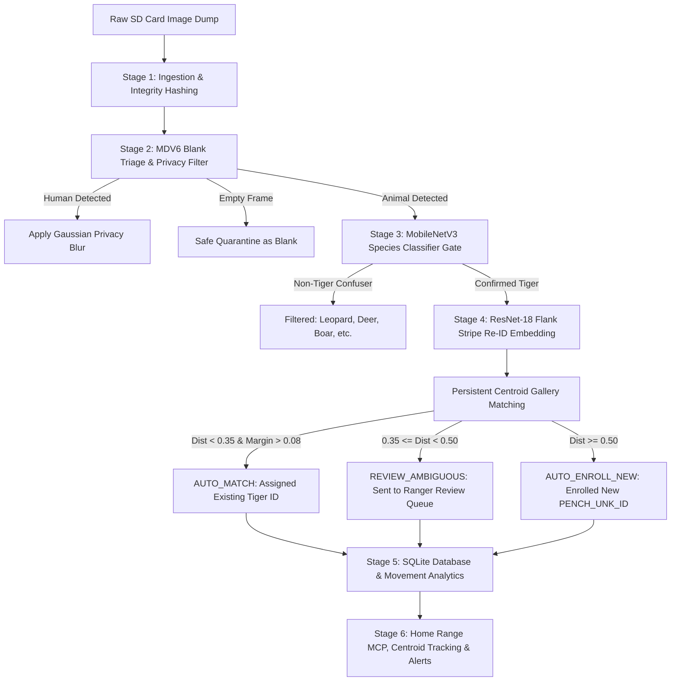

# 🐅 TigerTrace: AI Camera-Trap Intelligence Platform

[](https://nextjs.org/)
[](https://fastapi.tiangolo.com/)
[](https://onnxruntime.ai/)
[](https://opensource.org/licenses/MIT)

**TigerTrace** is an end-to-end, offline-first computer vision and geospatial intelligence platform designed specifically for **Pench Tiger Reserve, Maharashtra / Madhya Pradesh**. 

It transforms raw, noisy SD card camera trap dumps into clean, individual-level tiger sightings, spatial movement records, home-range estimates, and ecological boundary alerts.

---

## 🌟 Key Highlights & Accuracy Metrics

All metrics are benchmarked using strict **disjoint evaluation splits** (no self-matching) and real multi-species confuser datasets:

| Component | Architecture | Primary Metric | Score | Key Advantage |
| :--- | :--- | :--- | :--- | :--- |
| **Blank & Animal Triage** | MegaDetector V6 (YOLOv9-c) | Animal Recall | **>95%** | Filters ~60-80% empty blanks; blurs human faces for privacy |
| **Species Gate** | MobileNetV3-Large | Macro F1 / Recall | **100%** | Rejects non-tiger animals (Leopard, Sambar, Chital, Boar, Bear, Gaur) |
| **Stripe Re-ID Matching** | ResNet-18 + BNNeck | **Rank-1 Accuracy** | **99.17%** | 256-dim L2 stripe embedding across 107 known tiger identities |
| **Stripe Re-ID Retrieval** | ResNet-18 + BNNeck | **mAP Score** | **99.13%** | Centroid-based cosine similarity retrieval in persistent gallery |

---

## 🏗️ End-to-End Pipeline Architecture



---

## 🌟 Core Features & Web Platform

* **Automated Triage Dashboard (`/triage`)**: Scans bulk camera trap uploads, runs MDV6 to quarantine empty images, and tracks storage/time saved.
* **Individual Identification & Review Queue (`/identification`)**: Displays matched tiger profiles with stripe similarity confidence and routes ambiguous cases to human rangers.
* **Interactive Territorial Map (`/map`)**: Renders Minimum Convex Polygon (MCP) home-range territories and detects territorial overlap between rival tigers.
* **Proactive Ecological Alerts (`/alerts`)**: Real-time alerts for prolonged absence, territorial range shifts (>15km), village boundary proximity, and uncatalogued movements.
* **Patrol Priority Planner (`/patrol`)**: Optimizes ranger patrol routes based on camera trap sighting frequency and conflict risk.
* **Offline Conservation Assistant (`/chat`)**: Rule-based natural language query engine for park managers (zero external API dependencies).

---

## 📁 Directory Structure

```text
TigerTrace/
├── frontend/                     # Next.js 15 Web Application (Vercel target)
│   ├── src/
│   │   ├── app/                  # App Router pages (triage, identification, map, alerts, chat, patrol)
│   │   ├── components/           # UI components, MapView, Sidebar, modals
│   │   └── lib/api.ts            # Configurable API client
│   └── package.json
├── backend/                      # FastAPI Backend & Services
│   ├── services/                 # Business logic (triage, identification, geospatial, alerts, chatbot)
│   ├── TigerTrace/               # PyTorch / ONNX ML Computer Vision Pipeline
│   │   ├── configs/              # Pipeline hyperparameters
│   │   ├── models/checkpoints/   # Trained PyTorch & ONNX weights
│   │   └── src/                  # Detection, classification, Re-ID, analytics modules
│   ├── database.py               # SQLite schema & initialization
│   ├── main.py                   # FastAPI application router
│   └── requirements.txt
├── data/                         # SQLite seed database & logs
├── pench_camera_logs_ready.csv   # Pench reserve camera trap log dataset
└── README.md
```

---

## 🚀 Local Setup & Quickstart

### 1. Prerequisites
- **Python 3.10+**
- **Node.js 18+**

### 2. Backend Setup
```bash
cd backend

# Install dependencies
pip install -r requirements.txt

# Download MegaDetector V6 ONNX model (~101MB) if not already present
python -c "import urllib.request, os; os.makedirs('TigerTrace/models/pretrained', exist_ok=True); urllib.request.urlretrieve('https://zenodo.org/api/records/15398270/files/MDV6-yolov9-c.onnx/content', 'TigerTrace/models/pretrained/MDV6-yolov9-c.onnx')"

# Start FastAPI server
python -m uvicorn main:app --reload --port 8000
```
*API docs available at `http://localhost:8000/docs`.*

### 3. Frontend Setup
```bash
cd frontend

# Install Node packages
npm install

# Start Next.js dev server
npm run dev
```
*Frontend will be live at `http://localhost:3000`.*

---

## 🌐 Deployment Guide

### Deploying Frontend to Vercel
1. Import repository on [Vercel](https://vercel.com).
2. Set **Root Directory** to `frontend`.
3. Add Environment Variable:
   - `NEXT_PUBLIC_API_URL` = `https://your-backend-service.onrender.com`
4. Click **Deploy**.

### Deploying Backend to Render / Cloud
1. Create a **Web Service** on [Render](https://render.com).
2. Set **Root Directory** to `backend`.
3. Build Command: `pip install -r requirements.txt`
4. Start Command: `uvicorn main:app --host 0.0.0.0 --port $PORT`
