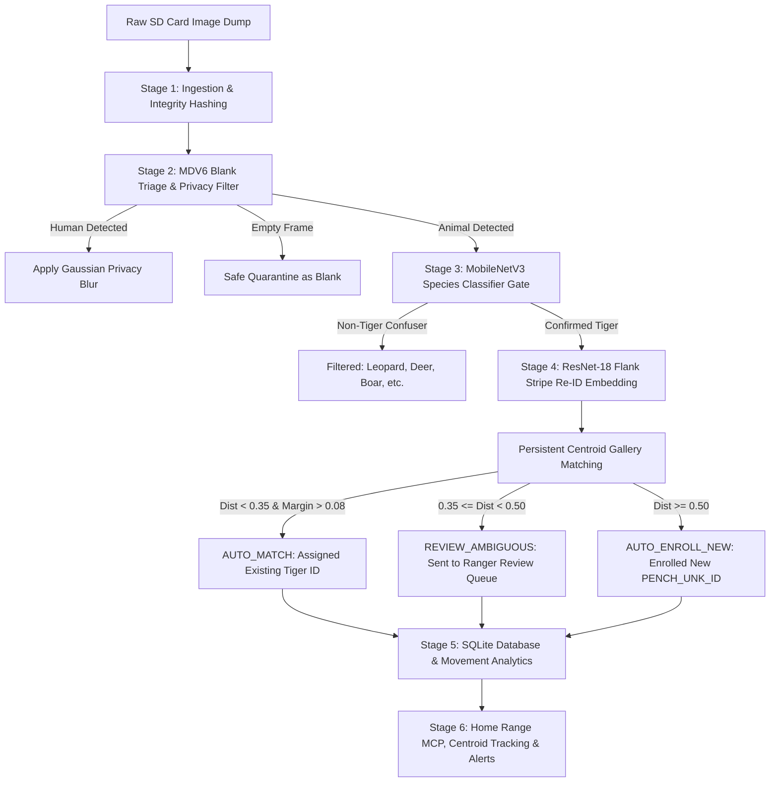

# 🐅 TigerTrace: AI Camera-Trap Intelligence Pipeline

[](https://www.python.org/)
[](https://pytorch.org/)
[](https://onnxruntime.ai/)
[](https://opensource.org/licenses/MIT)

**TigerTrace** is an end-to-end, offline-first computer vision and analytics intelligence system designed specifically for **Pench Tiger Reserve, Maharashtra / Madhya Pradesh**. 

It transforms raw, noisy SD card camera trap dumps into clean, individual-level tiger sightings, spatial movement records, home-range estimates, and ecological boundary alerts.

---

## 🌟 Key Highlights & Accuracy Metrics

All metrics are benchmarked using strict **disjoint evaluation splits** (no self-matching) and real multi-species confuser datasets:

| Component | Architecture | Primary Metric | Score | Key Advantage |
| :--- | :--- | :--- | :--- | :--- |
| **Blank & Animal Triage** | MegaDetector V6 (YOLOv9-c) | Animal Recall | **>95%** | Filters ~60-80% empty blanks; blurs human faces for privacy |
| **Species Gate** | MobileNetV3-Large | Macro F1 / Recall | **100%** | Rejects non-tiger animals (Leopard, Sambar, Chital, Boar, Bear, Gaur) |
| **Stripe Re-ID Matching** | ResNet-18 + BNNeck | **Rank-1 Accuracy** | **99.17%** | 256-dim L2 stripe embedding across 107 known tiger identities |
| **Stripe Re-ID Retrieval** | ResNet-18 + BNNeck | **mAP Score** | **99.13%** | Centroid-based cosine similarity retrieval in persistent gallery |

---

## 🏗️ End-to-End Pipeline Architecture

The pipeline processes camera trap image batches across 6 modular stages:



---

## 📁 Repository & Directory Layout

```
TigerTrace/
├── app/
│   ├── dashboard.py               # Streamlit field monitoring dashboard & review UI
│   └── assets/                    # Dashboard styles, logos, and UI assets
├── configs/
│   └── default.yaml               # Master configuration for all pipeline thresholds
├── scripts/
│   ├── 00_audit_atrw.py           # Validates ATRW tiger dataset integrity
│   ├── 01_download_inaturalist_negatives.py # Downloads real negative fauna via iNaturalist API
│   ├── 02_evaluate_models.py      # Standalone evaluation suite -> evaluation_report.json
│   └── export_onnx.py             # Exports trained PyTorch checkpoints to ONNX
├── src/
│   ├── analytics/
│   │   └── movement_engine.py     # Spatial analysis, MCP home ranges, and alert triggers
│   ├── classification/
│   │   ├── tiger_classifier.py    # MobileNetV3-Large species classification architecture
│   │   └── train_classifier.py    # Classifier training script with real fauna negatives
│   ├── database/
│   │   └── db.py                  # SQLite schema manager (8 relational tables)
│   ├── detection/
│   │   └── mdv6_inference.py      # MDV6 YOLOv9-c inference wrapper & privacy blurring
│   ├── ingest/
│   │   └── inventory.py           # Image hashing (SHA-256), EXIF parser, perceptual hash
│   ├── maps/                      # Spatial mapping & GeoJSON utilities
│   ├── pipeline/
│   │   └── run_pipeline.py        # MASTER PIPELINE orchestrator
│   └── reid/
│       ├── backbone.py            # ResNet-18 + BNNeck Re-ID network architecture
│       ├── gallery.py             # Persistent centroid-based embedding gallery
│       ├── losses.py              # Combined Triplet Loss + Cross-Entropy loss functions
│       └── train_reid.py          # Stripe Re-ID training script with disjoint eval
├── models/
│   ├── checkpoints/               # Trained PyTorch .pth weights (included in repo)
│   │   ├── classifier/best_tiger_classifier.pth (14 MB)
│   │   ├── reid/best_atrw_reid.pth (45 MB)
│   │   └── evaluation_report.json
│   ├── exported/                  # Trained ONNX models for CPU laptop inference (included)
│   │   ├── classifier/tiger_classifier.onnx (14 MB)
│   │   └── reid/tiger_reid.onnx (45 MB)
│   └── pretrained/                # Large pretrained models (ignored by git - download below)
│       └── MDV6-yolov9-c.onnx     (101 MB)
├── data/                          # [Ignored by git - local database & images]
│   ├── gallery/                   # tiger_gallery.npz & tiger_gallery_index.json
│   └── pench_wildlife.db          # Offline SQLite relational database
├── requirements.txt               # Pinned Python package dependencies
└── README.md                      # Complete system documentation
```

---

## 📦 Model Weights & Downloads

### 1. Models Included Directly in the Repository
Because our trained models are optimized and lightweight (<50 MB), they are **committed directly to this repository**:
* `models/checkpoints/classifier/best_tiger_classifier.pth` (~14 MB)
* `models/checkpoints/reid/best_atrw_reid.pth` (~45 MB)
* `models/exported/classifier/tiger_classifier.onnx` (~14 MB)
* `models/exported/reid/tiger_reid.onnx` (~45 MB)

### 2. Pretrained MegaDetector V6 (Download Required)
MegaDetector V6 (MDV6-yolov9-c) is ~101 MB and is excluded from git. Download it with one command:

#### Windows PowerShell:
```powershell
New-Item -ItemType Directory -Force -Path "models/pretrained"
Invoke-WebRequest -Uri "https://github.com/agentmorris/MegaDetector/releases/download/v6.0/MDV6-yolov9-c.onnx" -OutFile "models/pretrained/MDV6-yolov9-c.onnx"
```

#### Linux / macOS:
```bash
mkdir -p models/pretrained
curl -L -o models/pretrained/MDV6-yolov9-c.onnx "https://github.com/agentmorris/MegaDetector/releases/download/v6.0/MDV6-yolov9-c.onnx"
```

---

## 🗄️ Datasets Used

1. **ATRW (Amur Tiger Re-identification in the Wild)**:
   * 3,392 tiger crops across 107 individual identities for stripe Re-ID training.
   * Dataset source: [CVWC ATRW Challenge](https://cvwc2019.github.io/challenge.html).
2. **Pench Confuser Fauna Dataset (iNaturalist)**:
   * 1,500 research-grade field photos of co-habitant species in Pench Tiger Reserve:
     * Indian Leopard (*Panthera pardus*) - 400 images
     * Sambar Deer (*Rusa unicolor*) - 300 images
     * Chital / Spotted Deer (*Axis axis*) - 300 images
     * Wild Boar (*Sus scrofa*) - 200 images
     * Sloth Bear (*Melursus ursinus*) - 200 images
     * Indian Gaur (*Bos gaurus*) - 100 images
   * Download script included: `python scripts/01_download_inaturalist_negatives.py`

---

## 🚀 Quickstart & Usage

### 1. Installation
Clone the repository and install dependencies:
```bash
git clone https://github.com/1Yash-0/TigerTrace.git
cd TigerTrace

# Install Python requirements
pip install -r requirements.txt
```

*(Optional for GPU Training: install PyTorch with CUDA support)*
```bash
pip install torch torchvision --extra-index-url https://download.pytorch.org/whl/cu126
```

### 2. Run the Full End-to-End Pipeline
Process a folder of camera trap images through triage, species gating, stripe Re-ID, and database logging:
```bash
python -m src.pipeline.run_pipeline "path/to/raw_camera_images" "pench_batch_001"
```

### 3. Launch the Interactive Monitoring Dashboard
Explore detections, review ambiguous identities, inspect tiger home ranges, and view movement alerts:
```bash
streamlit run app/dashboard.py
```

### 4. Run the Standalone Model Evaluation Suite
Generate a comprehensive evaluation report on all test sets:
```bash
python scripts/02_evaluate_models.py
```
*(Outputs results to `models/checkpoints/evaluation_report.json`)*

---

## 💾 Database Schema (`data/pench_wildlife.db`)

The offline SQLite database maintains full relational integrity and auditability. Teammates developing frontend interfaces or behavioral algorithms can query these tables directly:

| Table | Description | Primary Key / Key Columns |
| :--- | :--- | :--- |
| `images` | Master image table with SHA-256, perceptual hash, triage status (`QUARANTINED_BLANK`, `RETAIN_ANIMAL`, `PRIVACY_BLURRED_HUMAN`) | `image_id`, `station_id`, `run_id` |
| `stations` | Camera trap station metadata (raw station, GPS lat/lon, zone: `core`/`buffer`, trap nights) | `station_id`, `gps_lat`, `gps_lon` |
| `detections` | All bounding boxes detected by MDV6 (`animal`, `person`, `vehicle`) with confidence scores | `detection_id`, `image_id`, `class_name` |
| `crops` | Extracted animal/tiger crops with image quality score (Laplacian sharpness) | `crop_id`, `detection_id`, `quality_score` |
| `individuals` | Individual tiger registry (`provisional_id`, `first_seen`, `last_seen`, `status`) | `individual_id` (e.g. `TIGER_042`, `PENCH_UNK_a1b2c3`) |
| `identity_matches` | Re-ID matching results per crop (`top_1_dist`, `top_2_dist`, `margin`, `decision`, `review_status`) | `match_id`, `crop_id`, `individual_id`, `decision` |
| `movement_records` | Spatial analytics per tiger (Minimum Convex Polygon MCP home range in sq km, centroid lat/lon, sighting count) | `record_id`, `individual_id`, `home_range_sq_km` |
| `alerts` | Autonomous ecological alerts (`ALERT_BOUNDARY_CROSSING`, `ALERT_CORE_ENCROACHMENT`, `ALERT_HIGH_MOVEMENT`) | `alert_id`, `individual_id`, `severity` |
| `runs` | Pipeline execution audit history (timings, blank counts, tiger counts, status) | `run_id`, `status` |

---

## ⚙️ Configuration & Tuning (`configs/default.yaml`)

All pipeline parameters and thresholds are centralized in `configs/default.yaml`. No code modifications are necessary to tune system behavior:

```yaml
triage:
  detector_model: "models/pretrained/MDV6-yolov9-c.onnx"
  animal_conf_threshold: 0.20        # Sensitivity for animal detection
  fast_triage_size: 640

classification:
  weights_path: "models/checkpoints/classifier/best_tiger_classifier.pth"
  tiger_conf_threshold: 0.50         # Gate threshold: only P(tiger) >= 0.50 goes to Re-ID
  crop_padding: 0.15

reid:
  weights_path: "models/checkpoints/reid/best_atrw_reid.pth"
  embedding_dim: 256
  auto_match_distance_threshold: 0.35 # Cosine distance threshold for automatic match
  ambiguity_margin_threshold: 0.08    # Required margin between Top-1 and Top-2 match
  min_quality_score_for_automatch: 0.60
```

---

## 👥 Integration Notes for Teammates

1. **For Frontend Developers**:
   * Connect directly to `data/pench_wildlife.db`.
   * The `identity_matches` table is your feed of tiger detections with decisions (`AUTO_MATCH`, `REVIEW_AMBIGUOUS`, `AUTO_ENROLL_NEW`).
   * The `alerts` table contains active warnings for park rangers.
2. **For Algorithm & Ecology Developers**:
   * The `movement_records` table already contains precomputed Minimum Convex Polygon (MCP) home-range areas and centroid coordinates calibrated for Pench's coordinates (Lat 21.65°–21.80°, Lon 79.25°–79.45°).
3. **For Field Deployment**:
   * The pipeline runs fully offline on CPU laptops using ONNX Runtime. No internet connection or GPU is required in the field.
